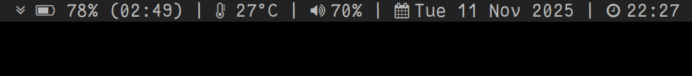

I was tired of other people's code crashing, breaking my setup, and then having to write and send patches to fix it. So I wrote my own.

This is a simple status bar that a surprising number of projects still manage to implement *incorrectly*.

### Dependencies
- `libuv`
- `libudev`
- `libasound2`

### Features
- Everything is asynchronous.
- Battery status is `poll`ed over netlink, so you don't have to wait 30 seconds to see an update. (yes, that was how it worked before)
- Volume level and mute state are monitored, again with no 30-second "please wait" delay.
- Display remaining time (hh:mm) when discharging
- No *growing* memory leak in the event loop! There is a *constant* leak, but that's just how any program that runs forever works.

The rest of the project is mostly the same as the original [dwmstatus](https://git.suckless.org/dwmstatus/).

**NOTE**: *BSD support has been dropped. Some parts of the project is still portable, but the battery and audio parts are Linux-only.
